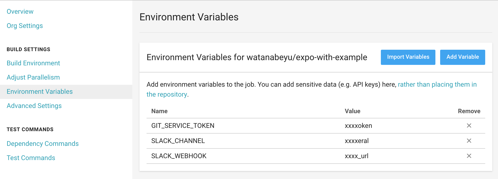

# expo-qr-notify
This repository inspired by https://github.com/expo/expo-postpublish-slack-notify.  
Post a notification on Slack and Github PR comment whenever your project is published.  
Presumably you already know this is happening so it's probably more useful to non-you people, such as your team or your grandparents.

## What is the difference with [expo-postpublish-slack-notify](https://github.com/expo/expo-postpublish-slack-notify)?
* If you set github token, it comment to github pull request by triggerd to circleci.
* Post a notification on Slack not only text but also QR image and url and pull request url.

## Installation
1. [Create an incoming webhook](https://api.slack.com/incoming-webhooks) and keep the window open with the URL.
2. `npm install --save-dev expo-qr-notify` in your project.
3. Setting a circleci project, and check on **Only build pull requests** (Settings >> Advanced Settings).
4. Add the following to your app.json within the "expo" key, or set a circleci environment variables.

### Configuration variables
|   |on app.json|on circleci|
|---|-----------|-----------|
|slack incoming url|`slack_webhook`|`SLACK_WEBHOOK`|
|notification channel|`slack_channel`|`SLACK_CHANNEL`|
|github user token|`git_service_token`|`GIT_SERVICE_TOKEN`|

#### app.json
```json
"hooks": {
  "postPublish": [
    {
      "file": "expo-qr-notify",
      "config": {
        "slack_webhook": "enter_your_slack_incoming_webhook_url",
        "slack_channel": "#general",
        "git_service_token": "enter_your_github_token"
      }
    }
  ]
}
```

#### circleci


## Example
[Check out example](./example).  
This is a simple example.  
If you run circleci, set below variables on [.circleci/config.yml](./example/.circleci/config.yml) or circleci environment variables, or set a circleci environment variables.
* `EXPO_ACCOUNT`
* `EXPO_PASSWORD`